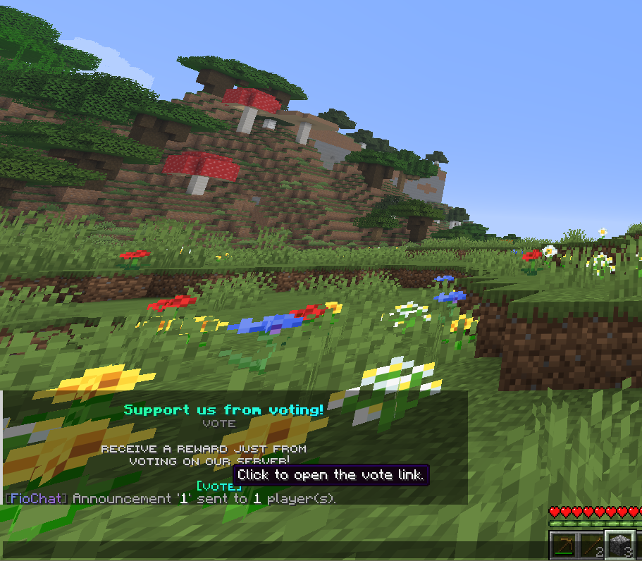

---
title: About
sidebar_position: 1
---

# FioChat

FioChat is a large all-in-one Paper chat suite that combines player chat systems, scheduled announcements, moderation utilities, UI display modules, reward systems, and several world or server tools in one plugin.


## What the plugin actually includes

### Chat systems

The current `modules/settings.yml` and `modules/chat/*` tree show that FioChat includes:

- emojis
- custom fonts
- chat color
- chat channels
- chat formats
- chat history
- per-world chat
- chat radius
- private messages
- replying message
- quick chat
- player mentions
- auto reply

### Announcement systems

The current `modules/announce/*` tree includes:

- advancements
- AFK
- biome discovery
- custom death messages
- custom join quit messages
- day counter
- mailbox
- message of the day
- mute chat
- server announcements
- welcome UI

### Moderation and utility systems

The current source also includes:

- reports
- vanish
- commands hider
- commands schedule
- chat management
- inventory inspection
- server auto restart
- inventory full alerts

### Display and reward systems

The current source also ships with:

- item display
- item tag
- region music
- region particle
- server display tag
- redeem code
- login streak rewards
- giveaway

## Major systems

### One plugin, many module families

The root switchboard in `modules/settings.yml` splits FioChat into these real runtime groups:

- `chat`
- `announce`
- `moderation`
- `display`
- `rewards`
- `alerts`
- `commands`

That matters because FioChat is not one small chat formatter with a few extras. The source is organized as a broad multi-module suite.

### Root command surface

The current `plugin.yml` registers many player-facing commands directly, including:

```text
/fiochat
/report
/reports
/emoji
/fonts
/toggle
/itemdisplay
/itemtag
/join
/quit
/giveaway
/id
/redeem
/loginstreak
/afk
/previousmsg
/ignore
/unignore
/channel
/quickchat
/chatcolor
/msg
/reply
/vanish
/mailbox
/invsee
/ecsee
/autorestart
/announcement
/announce
/event
/warning
/broadcast
/alerts
```

### Storage and language handling

The root `config.yml` currently includes:

- MiniMessage-based plugin prefix formatting
- language selection
- optional player-locale detection
- database type selection
- command aliases
- spy auto-enable settings
- player action logger settings
- Geyser or Floodgate Bedrock prefix handling

The current source comments also state that failed database setups fall back to YAML.

### Display tag ecosystem

One of the larger sub-systems in this build is the display-tag group. The source tree separates it into:

- `display_tag.yml`
- `animations.yml`
- `data.yml`

and `modules/settings.yml` shows its split sub-settings for:

- scoreboard
- bossbar
- tab
- nametag




## Data and integrations

The current `plugin.yml` and `pom.xml` show these important integrations:

- PlaceholderAPI
- Vault
- floodgate
- Geyser-Spigot
- WorldGuard
- AdvancedPortals
- Spark

The source also bundles Adventure libraries for MiniMessage and component serialization.

## Documentation map

Use these pages next:

- [Commands & Permissions](/plugin/fiochat/commands-permissions)
- [Actions](/plugin/fiochat/actions)
- [Options & Configuration](/plugin/fiochat/options)
- [Developer API](/plugin/fiochat/api)
- [Placeholders](/plugin/fiochat/placeholders)
- [Modules](/plugin/fiochat/modules/announcements)

:::info[Page note]
This page follows the current FioChat source tree and keeps the overview tied to real module groups, commands, and runtime files instead of older simplified summaries.
:::
