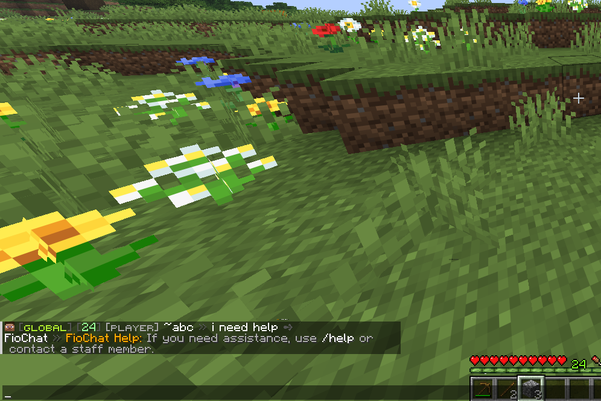

# Auto Reply Config

Source file:

```text
modules/chat/Bot Replying/config.yml
```

The Auto Reply module watches public chat and sends configured bot responses when a player's message matches one of the configured reply rules. The module is controlled by `modules.auto-reply` in `modules/settings.yml`.

The current default for `modules.auto-reply` is `true`.

## Module Preview




## `settings.debug-log`

```yaml
settings:
  debug-log: false
```

`settings.debug-log` controls debug logging for this config through FioChat's module debug system. The current value is `false`.

When enabled, debug output for the message service can include auto-reply reload details, matched rule information, and failures while sending titles, actionbars, bossbars, sounds, or commands. It does not change which messages match, does not bypass cooldowns, and does not force a response.

## `auto-reply.require-question-mark`

`auto-reply.require-question-mark` controls the default fallback reply detector. The current value is `true`.

This setting does not block structured rules under `auto-reply.replies` and does not block legacy rules under `auto-reply.rules`. Those rules match according to their own matcher and filters. This key only matters when no configured rule matches and `auto-reply.default-reply.enabled` is true.

When true, the default fallback only considers a message question-like if it contains `?`. When false, a message can also be treated as question-like if it starts with common question words such as `who`, `what`, `when`, `where`, `why`, `how`, `can`, `do`, `does`, `is`, or `are`.

## `auto-reply.cooldown-seconds`

`auto-reply.cooldown-seconds` controls the per-player cooldown for the default fallback reply. The current value is `15`.

The value is converted to milliseconds. Negative values are clamped to `0`, which disables this fallback cooldown. Structured rules can have their own per-player and global cooldowns under `filters`; legacy rules use this global fallback cooldown as their per-player cooldown.

## `auto-reply.bot-name`

`auto-reply.bot-name` is the bot name used in placeholders. The current value is `FioBot`.

The value is available as `%bot_name%` in response lines, titles, actionbars, bossbars, commands, hover text, and the global auto-reply format. The service also supports the older alias `auto-reply.bot`.

## `auto-reply.format`

`auto-reply.format` wraps every chat reply line sent by Auto Reply. The current value is:

```yaml
format: "<gray>[<white>%bot_name%</white><gray>]</gray> <white>%message%</white>"
```

When a rule response line is selected, FioChat first resolves that line and then stores the resolved line as `%message%`. The format is applied afterward. This means `%message%` in the format is the bot's reply text, not the player's original question. The player's original chat input is available as `%question%`, `%input%`, or `%message_input%`.

The service also supports the older alias `auto-reply.line-format`.

## `auto-reply.hover`

`auto-reply.hover` defines hover text attached to the formatted chat reply. The current value is:

```yaml
hover:
  - "<gray>Automatic reply</gray>"
```

Multiple hover lines are joined into one hover component. Placeholders are resolved before display. If the hover resolves to blank, FioChat sends a normal chat line without hover components.

## `auto-reply.default-reply.enabled`

`auto-reply.default-reply.enabled` controls whether FioChat sends a fallback response when no structured or legacy rule matches. The current value is `false`.

When false, unmatched messages are ignored. When true, FioChat checks `auto-reply.require-question-mark`, checks the fallback cooldown, and then sends `auto-reply.default-reply.lines` only to the player who asked the message.

## `auto-reply.default-reply.lines`

`auto-reply.default-reply.lines` is the fallback reply body. The current default contains:

```yaml
- "<gray>I do not have an answer for that yet.</gray>"
```

These lines are sent through the global `auto-reply.format`, so the visible output still includes `%bot_name%` and the bot prefix unless you change the format.

## `auto-reply.replies`

`auto-reply.replies` contains the structured rule system. These rules are loaded first, then legacy `auto-reply.rules` entries are loaded after them. All loaded rules are sorted by priority before matching.

The current structured rule ids are `server-ip-advanced`, `discord-advanced`, `vote-advanced`, `welcome-broadcast`, and `support-escalation`.

## `auto-reply.replies.<id>.enabled`

`enabled` controls whether a structured rule is loaded. The current structured rules all set `enabled: true`.

If this is false, the rule is skipped during reload. It will not match, will not consume cooldowns, and will not run any response channels.

## `auto-reply.replies.<id>.priority`

`priority` decides which matching rule is evaluated first. Higher priority wins. The current highest priority rule is `support-escalation` at `120`, followed by `server-ip-advanced` at `100`, `discord-advanced` at `90`, `vote-advanced` at `80`, and `welcome-broadcast` at `70`.

Only the first matching rule dispatches. If two rules have the same priority, the service sorts by rule id case-insensitively.

## `auto-reply.replies.<id>.match.type`

`match.type` selects the matcher. Supported structured types are `exact`, `contains`, `regex`, `starts_with`, `ends_with`, `keywords`, and `multi`.

Aliases are supported: `equals` means `exact`, `startswith` means `starts_with`, `endswith` means `ends_with`, and `keyword` or `intent` means `keywords`. Unknown match types fall back to `contains`.

## `match.type: "regex"`

Regex matchers use Java regular expressions with case-insensitive and Unicode-case flags. The matcher calls `find()`, so the pattern can match anywhere unless you anchor it with `^` and `$`.

Current regex examples:

```yaml
value: "\\b(server\\s*ip|ip address|what('?s| is) the ip)\\b"
value: "^hello bot[!?]*$"
value: "\\b(help|admin|staff|moderator)\\b"
```

If the regex is invalid, the rule simply does not match.

## `match.type: "multi"`

`multi` combines child matchers from `match.entries`. The current `discord-advanced` rule uses it with `logic: "OR"`.

With `OR`, any child matcher can match. With `AND`, every child matcher must match. Each child entry uses the same structured matcher shape, such as `type: "contains"` with a `value`, or `type: "regex"` with a `value`.

## `match.type: "keywords"`

`keywords` uses normalized keyword matching. The current `vote-advanced` rule uses:

```yaml
keywords_any:
  - "vote"
  - "voting"
  - "vote link"
keywords_exclude:
  - "devote"
```

Keyword matching lowercases text, removes punctuation into spaces, compresses whitespace, and then checks whole keywords or phrases. `keywords_exclude` blocks the match first. `keywords_all` can require every listed keyword or phrase. `minimum_any_matches` can require more than one `keywords_any` match and defaults to `1`.

## `auto-reply.replies.<id>.match.value`

`match.value` is used by simple matchers: `exact`, `contains`, `regex`, `starts_with`, and `ends_with`.

For `exact`, FioChat checks full case-insensitive equality first. It also treats the value as a standalone token or phrase inside a longer message, so short entries can still trigger when surrounded by boundaries.

## `auto-reply.replies.<id>.filters`

`filters` are optional extra requirements applied after the matcher succeeds. The current default file only uses `filters.min_length` on `support-escalation`, but the service supports more filter keys.

If any filter fails, the rule does not dispatch and matching continues to the next rule.

## `filters.min_length`

`filters.min_length` requires the trimmed player message to have at least that many characters. The current `support-escalation` rule uses `4`.

This prevents very short inputs from triggering staff-help logic unless the message has enough content to be intentional.

## `filters.max_length`

`filters.max_length` is supported even though it is not present in the current defaults. It rejects messages longer than the configured number of characters.

If omitted, it behaves as `Integer.MAX_VALUE`.

## `filters.worlds_mode` and `filters.worlds`

These keys restrict rules by world. `worlds_mode` accepts `blacklist`, `deny`, `whitelist`, `allow`, or no effective mode. The default mode for structured rules is `blacklist`.

With whitelist mode, the player's world must be listed. With blacklist mode, the player's world must not be listed. World names are compared case-insensitively.

## `filters.channels_mode` and `filters.channels`

These keys restrict rules by active FioChat channel. The service asks `ChatChannelService` for the sender's active channel id and falls back to `global` when no channel service or active channel is available.

The mode behavior is the same as world filters: whitelist requires the channel to be listed, blacklist rejects listed channels.

## `filters.require_permission`

`filters.require_permission` requires the sender to have a permission before the rule can fire.

This is useful when a bot reply should only answer staff, donors, or players who have unlocked a feature.

## `filters.deny_permission`

`filters.deny_permission` blocks the rule when the sender has the specified permission.

This is useful for preventing a basic help reply from triggering for staff or bypass groups.

## `filters.require_gamemode` and `filters.deny_gamemode`

These filters compare against the sender's Bukkit `GameMode`. Values are parsed case-insensitively into Bukkit enum names such as `SURVIVAL`, `CREATIVE`, `ADVENTURE`, or `SPECTATOR`.

Invalid gamemode names are ignored while loading.

## `filters.require_op` and `filters.deny_op`

`require_op` makes the rule staff/op-only by requiring `sender.isOp()`. `deny_op` blocks operators from triggering the rule.

Both default to false.

## `filters.require_starts_without_prefixes`

This list rejects messages that start with any configured prefix. Legacy rules default this list to `/`, which prevents command-looking input from triggering old rule entries.

Structured rules default to an empty list unless you configure it.

## `filters.chance`

`filters.chance` is a percentage from `0.0` to `100.0`. The service clamps values outside that range.

At `100`, the rule always passes the chance check. Below `100`, FioChat uses random selection each time the matcher and other filters pass.

## `filters.per_player_cooldown_seconds`

This gives one structured rule its own cooldown per player. It is independent from `auto-reply.cooldown-seconds`.

If a player triggers that rule, the same player cannot trigger that same rule again until the cooldown expires. Other rules can still match unless their own filters or cooldowns block them.

## `filters.per_rule_global_cooldown_seconds`

This gives one structured rule a global cooldown shared by all players.

If one player triggers the rule, nobody can trigger that same rule again until the global cooldown expires.

## `auto-reply.replies.<id>.response.audience`

`response.audience` decides who receives visual response channels. The current defaults use `player` for most rules and `all` for `welcome-broadcast`.

Supported values include `player`, `sender`, `self`, `all`, `*`, `permission`, `players-with-permission`, and `staff`. `permission` and `players-with-permission` require `response.permission_audience`. `staff` uses `response.permission_audience` when set, otherwise it defaults to `fiochat.admin`.

Console and player commands can still run even when there are no visual recipients.

## `response.permission_audience`

`permission_audience` is used when the audience is permission-based or staff-based.

For `permission` or `players-with-permission`, empty permission means no recipients are added. For `staff`, empty permission falls back to `fiochat.admin`.

## `response.mode`

`response.mode` controls whether `response.replies` are sent as chat. It defaults to `chat`.

If the mode is not `chat`, the rule can still send actionbar, title, bossbar, sound, or commands, but `response.replies` are not sent as chat lines.

## `response.replies`

`response.replies` is the list of chat reply lines for the rule. The current defaults use simple list entries.

The loader also supports weighted entries:

```yaml
replies:
  - text: "<gray>First possible answer.</gray>"
    weight: 70
  - text: "<gray>Second possible answer.</gray>"
    weight: 30
```

When `randomize_replies` is false, every reply line is sent in order. When it is true, one weighted reply is selected.

## `response.randomize_replies`

`randomize_replies` is supported and defaults to false. It is not present in the current default rules.

When true, the service treats `response.replies` as a weighted pool and sends one selected line. Entries with zero weight cannot be selected. If all weights are zero, no chat line is sent.

## `response.delay_ticks`

`delay_ticks` delays the dispatch after a rule has matched. It defaults to `0`.

The rule cooldown is applied before scheduling the delayed dispatch. If the player logs out before the delay finishes, the dispatch is skipped because the service resolves the live player again before executing.

## `response.actionbar.enabled`

This controls whether an actionbar response is sent. Current enabled examples are `server-ip-advanced`, `discord-advanced`, and `support-escalation`.

The actionbar is sent to the resolved audience, not necessarily only to the sender.

## `response.actionbar.text`

This is the actionbar text. It supports placeholders and FioChat color formatting.

Current examples include the server IP, the Discord invite, and `/report` staff-help guidance.

## `response.title.enabled`

This controls whether a Minecraft title is sent. Current enabled examples are `discord-advanced` and `support-escalation`.

If both title and subtitle resolve to blank, no title is sent. If the title is blank but subtitle is not, FioChat sends a single-space title so the subtitle can still display.

## `response.title.title`

This is the large title text. Current examples include `<aqua>Discord Community` and `<red>Need Staff Help?`.

It supports placeholders and FioChat formatting.

## `response.title.subtitle`

This is the smaller subtitle text under the title. Current examples include `<white>discord.gg/example</white>` and `<white>Use /report or open a ticket</white>`.

## `response.title.fade_in`

`fade_in` controls the title fade-in duration in ticks. Current title-enabled rules use `5`.

If omitted, the service defaults to `10`.

## `response.title.stay`

`stay` controls how long the title stays fully visible. Current values are `50` for Discord and `40` for support escalation.

The service enforces at least `1` tick.

## `response.title.fade_out`

`fade_out` controls the title fade-out duration in ticks. Current title-enabled rules use `10`.

## `response.bossbar.enabled`

This controls whether a temporary bossbar is displayed. Current enabled examples are `welcome-broadcast` and `support-escalation`.

The bossbar is created per recipient and removed after `response.bossbar.seconds`.

## `response.bossbar.title`

`title` is the bossbar text. The service also supports `response.bossbar.text`; if `text` exists, it is used before `title`.

Current examples include `%player_name% said hello to %bot_name%` and `Need help? /report`.

## `response.bossbar.color`

`color` is parsed as a Bukkit `BarColor`. Current defaults use `YELLOW` and `RED`.

Invalid values fall back to `YELLOW`.

## `response.bossbar.style`

`style` is parsed as a Bukkit `BarStyle`. Current defaults use `SOLID`.

Invalid values fall back to `SOLID`.

## `response.bossbar.progress`

`progress` controls the filled amount of the bossbar. The current defaults use `1.0`.

The service clamps the value between `0.0` and `1.0`.

## `response.bossbar.seconds`

`seconds` controls how long the bossbar remains visible. Current examples use `3` and `4`.

The service enforces at least one second.

## `response.sound.enabled`

This controls whether a sound is played. Current enabled examples are `server-ip-advanced`, `vote-advanced`, and `support-escalation`.

The sound is played to each visual recipient in the response audience.

## `response.sound.sound`

`sound` is the Bukkit sound name. Current values include `ENTITY_EXPERIENCE_ORB_PICKUP`, `BLOCK_NOTE_BLOCK_PLING`, and `BLOCK_NOTE_BLOCK_BELL`.

If the compatibility resolver cannot resolve the sound, no sound is played.

## `response.sound.volume`

`volume` is passed to Bukkit's sound playback call. Current defaults use `1.0`.

## `response.sound.pitch`

`pitch` is passed to Bukkit's sound playback call. Current values include `1.15`, `1.2`, and `1.0`.

## `response.commands.console`

Console commands are dispatched from the server console after placeholders and formatting are resolved and color codes are stripped.

The current `support-escalation` rule runs:

```yaml
- "say [AutoReply] %player_name% requested staff help."
```

If a configured command starts with `/`, the slash is removed before dispatch.

## `response.commands.player`

Player commands are dispatched as the sender. The current `vote-advanced` rule runs:

```yaml
- "vote"
```

Use this only for commands the triggering player should execute. The sender must still be online when the response dispatch runs.

## `response.log_trigger`

`log_trigger` is supported and defaults to false. If a rule response has this false, the matched-rule debug line is suppressed for that rule. The default fallback always logs through the default path when debug logging is active.

## Auto Reply placeholders

Response text, hover text, titles, actionbars, bossbars, and commands can use:

```text
%player%
%player_name%
%question%
%input%
%message_input%
%bot_name%
%channel%
%channel_id%
%world%
%rule_id%
%message%
```

`%message%` is special in the global format: for chat replies, it becomes the resolved bot reply line. The original player input remains available through `%question%`, `%input%`, and `%message_input%`.

## Current structured replies

`server-ip-advanced` has priority `100`, uses a regex for server IP questions, replies only to the player, sends the server IP in chat, shows an actionbar, and plays `ENTITY_EXPERIENCE_ORB_PICKUP`.

`discord-advanced` has priority `90`, uses a multi matcher with `discord` contains or a Discord regex, replies only to the player, sends a chat line, title, and actionbar.

`vote-advanced` has priority `80`, uses keyword matching for vote-related phrases while excluding `devote`, replies only to the player, runs the `vote` player command, and plays `BLOCK_NOTE_BLOCK_PLING`.

`welcome-broadcast` has priority `70`, matches exactly `hello bot` with optional `!` or `?`, sends the reply to all online players, and shows a yellow bossbar for three seconds.

`support-escalation` has priority `120`, matches help/staff/admin/moderator words, requires at least four characters, replies to the player, runs a console log command, sends a title, actionbar, red bossbar, and bell sound.

## `auto-reply.rules`

`auto-reply.rules` is the legacy rule format. It is still loaded after structured replies.

The current legacy rule ids are `server-ip`, `discord`, `website`, `how-to-claim`, and `vote`.

Legacy rules are converted into normal auto-reply rules with priority `0`, OR logic across their triggers, audience `player`, chat mode, no actionbar/title/bossbar/sound/commands, and per-player cooldown inherited from `auto-reply.cooldown-seconds`.

## `auto-reply.rules.<id>.enabled`

This controls whether a legacy rule is loaded. All current legacy defaults set it to `true`.

## `auto-reply.rules.<id>.triggers`

`triggers` is the list of input phrases for a legacy rule. The loader also supports old aliases named `keywords` and `match`.

Each trigger becomes one child matcher. The legacy rule matches when any child matcher matches.

## `auto-reply.rules.<id>.match-mode`

`match-mode` controls how legacy triggers are interpreted. Current defaults use `contains`.

Supported legacy values include `contains`, `equals_any`, `starts_with_any`, `ends_with_any`, and `regex_any`. These map to structured `contains`, `exact`, `starts_with`, `ends_with`, and `regex`.

The loader also supports `mode` as an alias.

## `auto-reply.rules.<id>.lines`

`lines` is the list of chat reply lines for a legacy rule. The loader also supports old aliases named `reply` and `messages`.

Like structured chat replies, legacy lines are sent through the global `auto-reply.format` and hover text.

## Current legacy rules

`server-ip` answers `ip`, `server ip`, and `what is the ip` with `play.example.com`.

`discord` answers `discord`, `dc`, and `discord link` with `discord.gg/example`.

`website` answers `website`, `web`, and `store` with `store.example.com`.

`how-to-claim` answers claim-related phrases with `/rewards` and `/warp claim`.

`vote` answers vote-related phrases with `/vote`.

## Legacy path note

The active config path for this build is:

```text
modules/chat/Bot Replying/config.yml
```

The plugin still knows the older `modules/auto-reply/config.yml` path and can migrate embedded auto-reply data, but this documentation follows the current module path.

:::info[Page note]
This page is source-backed and includes a short callout so the content reads like a guide instead of plain reference text.
:::
