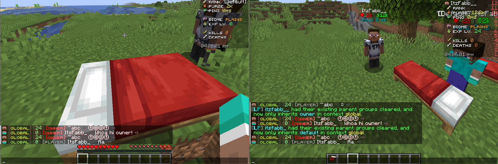

# Chat Formats Config

Source file:

```text
modules/chat/Chat Formats/config.yml
```

The Chat Formats module controls FioChat's main chat rendering pipeline. In the current build, it is enabled by the master toggle `modules.formats` in `modules/settings.yml`.

The active config path is the one above. FioChat can still migrate older module files from:

```text
modules/formats/config.yml
modules/chat/formats/config.yml
```

## Module Preview



## `modules.formats`

```yaml
modules:
  formats: true
```

`modules.formats` is the master toggle for this module. The current default is `true`.

When this is `false`, FioChat does not apply the chat formatting templates and rank-based chat layout from this config.

## `settings.debug-log`

```yaml
settings:
  debug-log: false
```

`settings.debug-log` controls module debug logging. The current value is `false`.

When enabled, FioChat can write extra diagnostics while loading formats, resolving placeholders, matching ranks, and applying chat actions. It does not change the visible format logic.

## `number-format.suffixes`

```yaml
number-format:
  suffixes:
    - ""
    - "K"
    - "M"
    - "B"
    - "T"
    - "Q"
```

`number-format.suffixes` controls how FioChat shortens values used by `*_fc_formatted` placeholders.

The current suffix list maps values into compact labels such as `K`, `M`, `B`, `T`, and `Q`. Index `0` is empty so numbers below `1,000` stay unchanged.

## `settings.sprite-object.enabled`

```yaml
settings:
  sprite-object:
    enabled: true
```

This toggle controls sprite, head, and texture object rendering in chat. The current default is `true`.

When disabled, sprite-style objects and player-head style objects stay as plain text instead of being rendered as chat icons.

## `settings.sprite-object.player.face`

```yaml
settings:
  sprite-object:
    player:
      face: true
```

`face` controls the profile face shown on the left side of chat formats. The current default is `true`.

## `settings.sprite-object.player.head`

```yaml
settings:
  sprite-object:
    player:
      head: true
```

`head` controls `[p:%player_name%]` style placeholders. The current default is `true`.

## `settings.sprite-object.player.texture.enabled`

```yaml
settings:
  sprite-object:
    player:
      texture:
        enabled: true
```

`texture.enabled` controls `[t:<texture>]` rendering. The current default is `true`.

## `settings.sprite-object.need-extra-space`

```yaml
settings:
  sprite-object:
    need-extra-space: true
```

This adds a small spacing buffer so text does not stick too tightly to sprite or object icons. The current default is `true`.

## `settings.sprite-object.hide-invisible-head`

```yaml
settings:
  sprite-object:
    hide-invisible-head: false
```

This controls whether invisible player heads are hidden. The current default is `false`.

## `settings.sprite-object.atlas`

```yaml
settings:
  sprite-object:
    atlas:
      item: "minecraft:items"
      block: "minecraft:blocks"
```

`atlas.item` and `atlas.block` define the default atlas sources used by the sprite system.

## `settings.sprite-object.item-textures-use-block-atlas`

```yaml
settings:
  sprite-object:
    item-textures-use-block-atlas: true
```

This keeps item textures rendered from the block atlas when needed. The current default is `true`.

## `settings.sprite-object.strict-player-names`

```yaml
settings:
  sprite-object:
    strict-player-names: true
```

This makes player-name parsing stricter so name tokens are less ambiguous. The current default is `true`.

## `settings.inline-object-blacklist`

```yaml
settings:
  inline-object-blacklist:
    sprite:
      - "stone"
      - "[s:blaze_powder]"
    player:
      - "[p:Notch]"
      - "Microsoft"
```

This blacklist keeps listed sprite or player tokens as plain text instead of rendering them as inline objects.

Sprite and player entries are matched case-insensitively.

## `settings.markup`

```yaml
settings:
  markup:
    bold: true
    italic: true
    underlined: true
    strikethrough: true
    spoiler: true
```

These toggles control markdown-like chat markup support. The current defaults keep all of them enabled.

## `settings.chat-sound`

```yaml
settings:
  chat-sound:
    enabled: true
    sound: "BLOCK_BUBBLE_COLUMN_BUBBLE_POP"
    volume: 2.9
    pitch: 1.25
```

This plays a chat feedback sound when formatted chat events are processed.

## `fallback.structure`

```yaml
fallback:
  structure: "%group% %player% %message%"
```

`fallback.structure` defines the base layout used when no role-specific format matches. The current default keeps group, player, and message in a compact order.

## `fallback.shadow_settings`

```yaml
fallback:
  shadow_settings:
    enabled: true
    color: "#FFFFFF"
    opacity: "1.0"
```

This applies a global shadow wrapper to the fallback format.

If enabled, FioChat wraps the final fallback structure in a shadow using the configured color and opacity.

## `fallback.player`

```yaml
fallback:
  player:
    format: "<white>%player_name%</white>"
```

`fallback.player.format` controls how the player name segment is rendered in the fallback layout.

The current config also allows hover content on this segment.

## `fallback.group`

```yaml
fallback:
  group:
    format: "%luckperms_prefix%"
```

`fallback.group.format` controls the rank or prefix segment used by the fallback layout.

This segment also supports hover content and conditional actions under `msgaction`.

## `fallback.message`

```yaml
fallback:
  message:
    format: "<dark_gray>></dark_gray> <white>%message%</white>"
```

`fallback.message.format` controls the actual chat message body in the fallback layout.

This segment can also carry hover text and click actions, which makes it useful for moderation or report flows.

## `format.default`

`format.default` is the main role format used by players whose Vault group does not have a dedicated section.

The current default structure is:

```yaml
format:
  default:
    shadow_settings:
      enabled: true
      color: "#000000"
      opacity: "0.1"
    structure: "%xp_lvl% %rank% %player%%discord% %message%"
```

This layout combines the XP segment, rank badge, player segment, Discord status segment, and message segment.

## `format.owner`

`format.owner` is the dedicated owner role style.

The source config gives it a stronger shadow color and a more prominent rank badge than the default role.

## `format.admin`

`format.admin` is the dedicated admin role style.

It keeps the same general structure as `default`, but uses its own rank badge styling.

## `format.mod`

`format.mod` is the dedicated moderator role style.

This role uses a more compact structure:

```yaml
structure: "%rank% %player% %message%"
```

## `format.<role>.structure`

`structure` controls the component order for each role.

The current config supports component placeholders such as:

```text
%xp_lvl%
%player%
%rank%
%discord%
%message%
%msg%
```

Any component that is missing or hidden is removed automatically, and extra spacing is compacted.

## `format.<role>.player`

`player.format` controls the player segment for a role.

This segment can also include hover text and click actions.

## `format.<role>.rank`

`rank.format` controls the rank badge or prefix rendering for a role.

This segment is the main place to style group labels such as `default`, `mod`, `admin`, or `owner`.

## `format.<role>.discord`

The `discord` component shows a conditional Discord link indicator.

The current config uses two branches:

```yaml
discord:
  if_return_as_yes:
    check: "%discordsrv_user_islinked%==yes"
    format: "<green>●</green> "
  if_return_as_no:
    check: "%discordsrv_user_islinked%==no"
    format: "<gray>â—‹</gray> "
```

This is rendered inline when the linked or unlinked condition matches.

## `format.<role>.xp_lvl`

The `xp_lvl` component shows compacted player XP levels.

It uses `*_fc_formatted` placeholders, so large values are shortened automatically.

## `format.<role>.message`

`message.format` controls the final chat message text for the role.

This segment can also include hover and click actions. In the current config, the message segment is used for report shortcuts.

## Hover And Actions

Hover and click actions are supported in any component section.

The current config uses these action types:

```text
run_command
suggest_command
copy_to_clipboard
open_url
```

These are especially useful on player, rank, and message segments.

## Placeholder Support

Common placeholders used by this module include:

```text
%player_name%
%name%
%displayname%
%rank_id%
%rank_name%
%vault_group%
%lp_rank_id%
%world%
%world_prefix%
%world_tag%
%channel%
%message%
```

The structure placeholders are:

```text
%xp_lvl%
%player%
%rank%
%msg%
```

`%msg%` is the message alias used by the structure layer, while `%message%` is the actual message body placeholder used inside component formats.

## Legacy Path Note

The active config path for this build is:

```text
modules/chat/Chat Formats/config.yml
```

The plugin can still migrate older config paths from:

```text
modules/formats/config.yml
modules/chat/formats/config.yml
```

This page follows the current module path and the current chat-format layout used by the build.

:::info[Page note]
This page is source-backed and includes a short callout so the content reads like a guide instead of plain reference text.
:::
