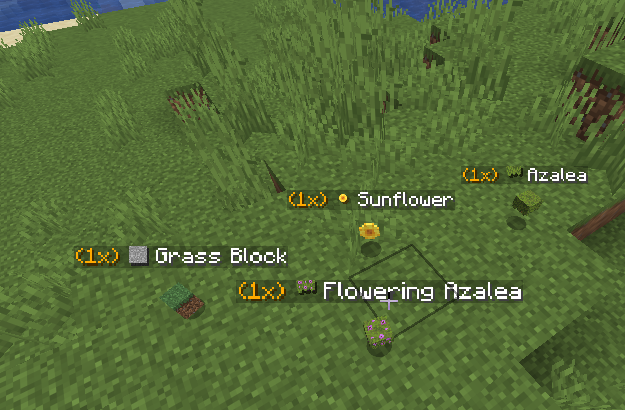

# ItemTag Config

Source file:

```text
modules/display/Item Drop Tag/config.yml
```

:::warning[Important]
ItemTag uses runtime display entities. Tune update interval and visibility scope first to avoid performance spikes on high-drop servers.
:::

## Module Preview



## Core Stack Behavior

### Stack Limits and Display Policy
```yaml
settings:
  stack-limit: -1
  only-show-single-item: true
```
- Purpose: Controls how item stack labels are shown.
- Options:
  - `stack-limit: -1` usually means no hard stack cap override.
  - `only-show-single-item: true` limits visual clutter from bulk drops.

### World and Region Scope
```yaml
settings:
  world-whitelist: []
  world-blacklist: []
  region-whitelist: []
  region-blacklist: []
```
- Purpose: Restricts where ItemTag is active.
- Options:
  - Use blacklist for heavy farm/minigame worlds.
  - Use whitelist for controlled showcase worlds.

## Stack Particle Layer

### Particle Toggle and Type
```yaml
settings:
  stack-particle:
    enabled: true
    type: "DUST"
    count: 5
    size: 0.95
    speed: 0.01
```
- Purpose: Adds visual signal around stacked drops.
- Options:
  - Lower `count` and `speed` for performance-friendly behavior.
  - Keep `DUST` for customizable color gradients.

### Particle Colors
```yaml
settings:
  stack-particle:
    color:
      primary: "#FF0000"
      secondary: "#FF9999"
```
- Purpose: Defines stack particle color palette.
- Options:
  - Use colors that remain readable in your active biome lighting.

## Auto-Stack Engine

### Auto Merge Settings
```yaml
settings:
  auto-stack:
    enabled: true
    radius: 1.5
    interval-ticks: 10
```
- Purpose: Merges nearby item entities automatically.
- Options:
  - Larger radius increases merge aggressiveness.
  - Higher interval reduces CPU usage.

## Tag Format Output

### Display Lines
```yaml
settings:
  format:
    - "<gold>(%amount%x)</gold> <white>[s:%material_id%] %materialName%</white>"
    - ""
```
- Purpose: Controls text shown above dropped items.
- Options:
  - Keep first line concise and info-rich.
  - Use optional empty lines sparingly.

## Sprite Rendering

### Sprite Path Resolution
```yaml
settings:
  sprite:
    force-item-path: false
```
- Purpose: Controls how texture paths are resolved.
- Options:
  - Enable force-item-path only if block/item atlas mapping conflicts.

### Sprite Overrides
```yaml
settings:
  sprite:
    overrides:
      grass_block: "block/grass_block_top"
      stone: "block/stone"
      bamboo: "item/bamboo"
```
- Purpose: Remaps specific materials to cleaner texture icons.
- Options:
  - Use overrides for awkward default render cases.

### Sprite Blacklist
```yaml
settings:
  sprite:
    blacklist:
      - "rose_bush"
      - "leaf_litter"
      - "moss_carpet"
```
- Purpose: Excludes problematic or noisy materials from sprite rendering.
- Options:
  - Expand list for decorative blocks that render poorly as tags.

## Text Display Entity Tuning

### Text Display Runtime
```yaml
settings:
  text-display:
    billboard: "CENTER"
    shadowed: true
    see-through: true
    default-background: false
    line-width: 200
    view-range: 32.0
    text-opacity: 255
```
- Purpose: Controls visual behavior of Minecraft `TEXT_DISPLAY` entity.
- Options:
  - `view-range`: lower for performance, higher for visibility.
  - `text-opacity`: reduce for softer overlays.

### Background Layer
```yaml
settings:
  text-display:
    background:
      enabled: false
      color: "#66000000"
```
- Purpose: Optional backing panel for contrast.
- Options:
  - Enable only if text readability is poor in bright areas.

## Update Cycle and Performance

### Refresh Interval
```yaml
settings:
  update-interval-ticks: 5
```
- Purpose: Controls how often ItemTag text/entities are refreshed.
- Options:
  - Lower interval = more responsive updates, higher cost.
  - Higher interval = lighter performance, slower visual sync.

:::info[Performance Baseline]
For busy survival servers, start with:
- `auto-stack.interval-ticks: 10-20`
- `update-interval-ticks: 8-12`
- reduced particle count
:::

:::note[Owner Validation]
- Test dropped-item hotspots (farms/mob grinders) for TPS impact.
- Verify auto-stack merges correctly across common drop types.
- Verify sprite overrides and blacklist entries resolve as expected.
- Verify text readability in day/night and dark biomes.
- Verify world/region filters are respected.
:::


